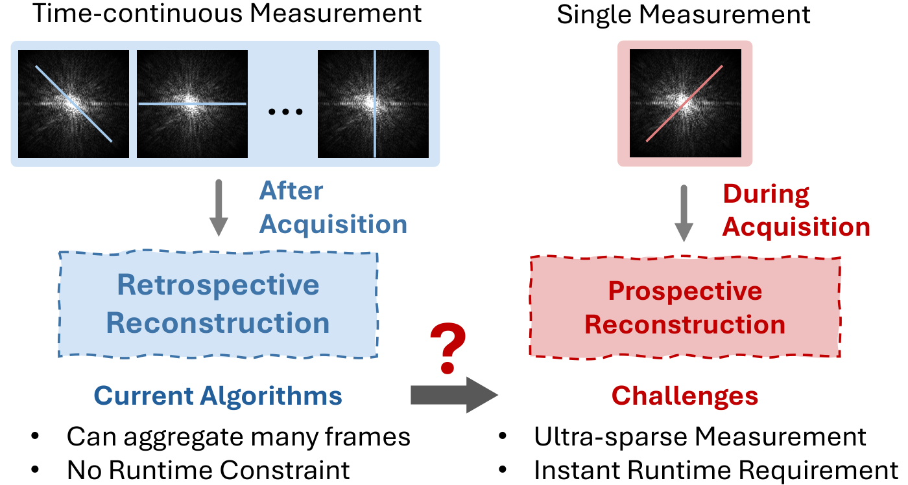
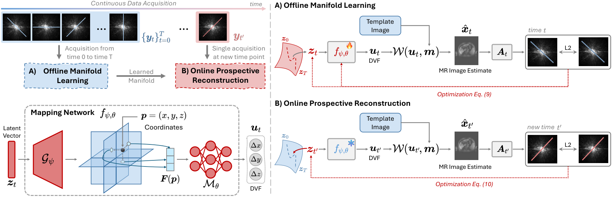
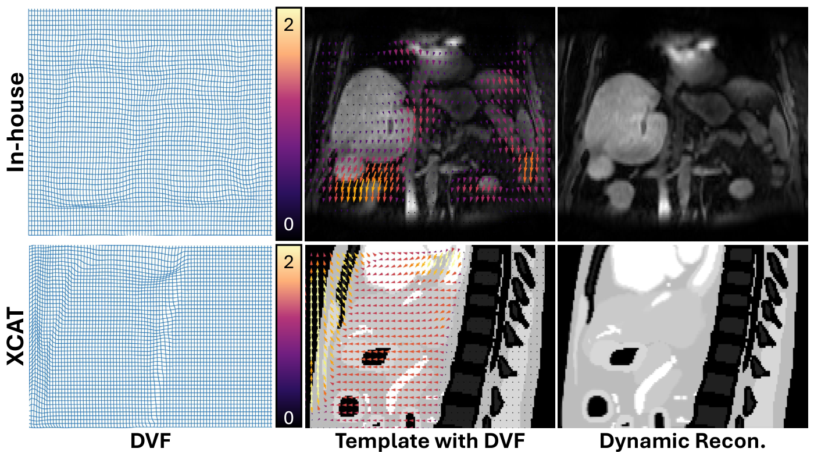
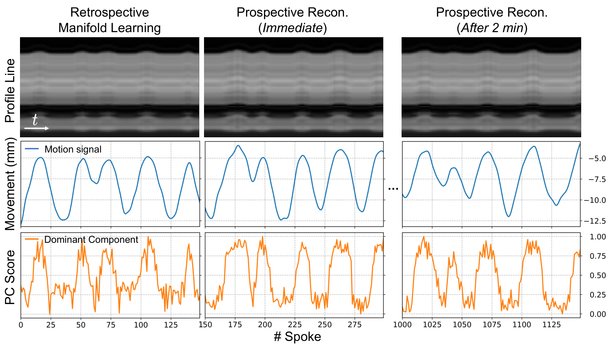
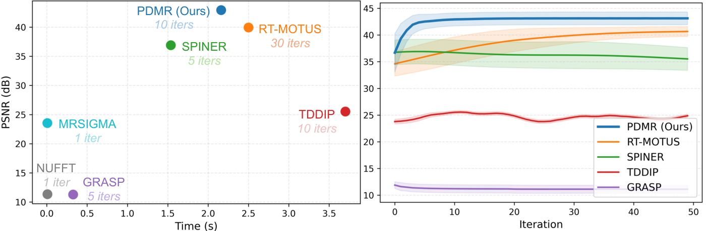

# PDMR

### Prospective Dynamic 3D MRI Reconstruction via Latent-Space Motion Tracking from Single Measurement

**CVPR 2026** | [Paper PDF](Prospective_Recon.pdf)

This is the official project page of our work **"Prospective Dynamic 3D MRI Reconstruction via Latent-Space Motion Tracking from Single Measurement"**.

<p>
  <a href="https://maopaom.github.io/">Lixuan Chen</a><sup>1</sup>&nbsp;&nbsp;
  <a href="https://liyueshen.engin.umich.edu/people/">Zhongnan Liu</a><sup>1</sup>&nbsp;&nbsp;
  <a href="https://bme.umich.edu/people/hamilton-jesse/">Jesse Hamilton</a><sup>1</sup>&nbsp;&nbsp;
  <a href="https://medschool.umich.edu/profile/4905/james-m-balter">James M. Balter</a><sup>1</sup>&nbsp;&nbsp;
  <br>
  <a href="https://jjparkcv.github.io/">Jeong Joon Park</a><sup>1✉️</sup>&nbsp;&nbsp;
  <a href="https://liyueshen.engin.umich.edu/">Liyue Shen</a><sup>1✉️</sup>&nbsp;&nbsp;
</p>

<p>
  <sup>1</sup>University of Michigan
</p>

---

## Overview

Prospective reconstruction is crucial for clinical applications such as MRI-guided radiotherapy, where the system must reconstruct the current anatomy and estimate motion from measurements acquired within the current latency window. This setting is challenging because each online update has only an ultra-sparse single measurement and an instant runtime requirement.

**PDMR** learns a patient-specific latent manifold of deformation vector fields offline, then performs online prospective reconstruction by optimizing only a low-dimensional latent vector. A geometry-aware tri-plane mapping network decodes the latent code into fine-grained 3D motion fields, enabling fast, motion-aware reconstruction from single-shot measurements.



---

## Method

PDMR has two stages:

- **Offline manifold learning:** learn a compact motion manifold and DVF mapping network from time-continuous sparse measurements.
- **Online prospective reconstruction:** freeze the mapping network and rapidly adapt only the latent vector for each new instantaneous measurement.



---

## Results

### Motion Field Visualization

The estimated DVFs capture respiratory dynamics while preserving anatomically static regions.



### Latent Space Analysis

The dominant component of the learned latent vectors follows the respiratory motion signal across retrospective learning and prospective reconstruction settings.



### Runtime and Reconstruction Quality

PDMR achieves strong reconstruction fidelity with fast latent-space adaptation.



---

## Dynamic Visualizations

### Coronal View

<video src="Fig/video-coronal.mp4" controls muted loop playsinline width="100%"></video>

### Sagittal View

<video src="Fig/video-sagittal.mp4" controls muted loop playsinline width="100%"></video>

> If the videos do not render, open them directly: [coronal](Fig/video-coronal.mp4), [sagittal](Fig/video-sagittal.mp4).


---

## Citation

```bibtex
@InProceedings{Chen_2026_CVPR,
    author    = {Chen, Lixuan and Liu, Zhongnan and Hamilton, Jesse and Balter, James M. and Park, Jeong Joon and Shen, Liyue},
    title     = {Prospective Dynamic 3D MRI Reconstruction via Latent-Space Motion Tracking from Single Measurement},
    booktitle = {Proceedings of the IEEE/CVF Conference on Computer Vision and Pattern Recognition (CVPR)},
    month     = {June},
    year      = {2026},
    pages     = {5627-5636}
}
```
